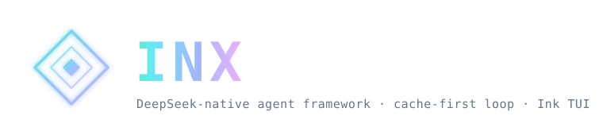

<p align="center">
  
</p>

<p align="center">
  <strong>简体中文</strong>
  &nbsp;·&nbsp;
  <a href="./docs/GUIDE.md">指南</a>
  &nbsp;·&nbsp;
  <a href="./docs/ACP.md">ACP</a>
  &nbsp;·&nbsp;
  <a href="./docs/SPEC.md">規格</a>
  &nbsp;·&nbsp;
  <a href="https://github.com/naamfung/Nix/">官網</a>
  &nbsp;·&nbsp;
  <strong><a href="https://discord.gg/XF78rEME2D">Discord</a></strong>
</p>

<p align="center">
  <a href="https://www.npmjs.com/package/nix"></a>
  <a href="https://github.com/naamfung/Nix/actions/workflows/ci.yml"></a>
  <a href="./LICENSE"></a>
  <a href="https://www.npmjs.com/package/nix"></a>
  <a href="https://github.com/naamfung/Nix/stargazers"></a>
  <a href="https://atomgit.com/naamfung/Nix"></a>
  <a href="https://github.com/naamfung/Nix/graphs/contributors"></a>
  <a href="https://github.com/naamfung/Nix/discussions"></a>
  <a href="https://discord.gg/XF78rEME2D"></a>
</p>

<br/>

<h3 align="center">面向終端的 DeepSeek 原生 AI coding agent。</h3>
<p align="center">由配置與插件驅動的極薄 harness——單一靜態 Go 二進制，圍繞 DeepSeek 的前綴緩存調優，長會話也能把 token 成本壓低。</p>

<br/>

> [!IMPORTANT]
> **加入社區 · Community** — 雙語 Discord，提供安裝答疑（`#help` / `#求助`）、工作流展示與功能想法。→ **<https://discord.gg/XF78rEME2D>**

<br/>

## 特性

- **配置驅動**：provider、agent、啟用的工具、插件全部在 `nix.toml` 中聲明，
  內核無硬編碼模型。
- **多模型 · 可組合**：DeepSeek 作為預設內建；任何 OpenAI 兼容
  端點都只是一條配置。可選讓兩個模型協同（執行器 + 規劃器），各自獨立、緩存穩定的 session。
- **插件驅動**：外部工具以子進程形式運行，通過 stdio JSON-RPC 通信（MCP 兼容）；
  內建工具在編譯期自註冊。
- **緩存友好的上下文維護**：啟動時注入穩定的環境摘要；舊工具輸出會先 snip/prune，
  再進入摘要 compaction；內建工具 schema 合約有文檔和回歸測試保護。
- **零摩擦分發**：`CGO_ENABLED=0` 單一二進制；一條命令交叉編譯到六個目標平台。
  唯一依賴是一個 TOML 解析庫。

## 安裝

選擇適合你的使用路徑。CLI/TUI、桌面端和 VS Code 擴展都使用同一套本地
Nix 引擎。

### 路徑 A：CLI / TUI

任意支持的平台都可以通過 npm 安裝原生二進制：

```sh
npm i -g nix                  # 任意系統;自動拉取對應平台的原生二進制
```

預編譯歸檔(`darwin|linux|windows × amd64|arm64`)和 `SHA256SUMS` 見每個
[GitHub release](https://github.com/naamfung/Nix/releases)。

### 路徑 B：桌面端

前往[官方下載頁](https://github.com/naamfung/Nix/releases)獲取最新桌面版本。

| 平台 | 包安裝包 | 架構 |
| --- | --- | --- |
| macOS | 通用 `.dmg` 或 `.zip` | Apple Silicon / Intel |
| Windows | 安裝器 `.exe` 或便攜 `.zip` | x64 / ARM64 |
| Linux | `.deb` 或 `.tar.gz` | x64 |

Windows 安裝器通過 [SignPath.io](https://signpath.io/) 完成代碼簽名，證書由
[SignPath 基金會](https://signpath.org/) 免費提供。

### 路徑 C：VS Code 擴展

請先完成路徑 A。擴展不內置 CLI，而是啟動本機的 `nix acp` 後端，
並提供原生聊天、編輯器上下文、工具調用審批、模型選擇和工作區會話。

- **VS Code：** [從 Visual Studio Marketplace 安裝](https://marketplace.visualstudio.com/items?itemName=SivanLiu.nix-agent)
- **VSCodium / Eclipse Theia：** [從 Open VSX Registry 安裝](https://open-vsx.org/extension/SivanLiu/nix-agent)
- **擴展 ID：** `SivanLiu.nix-agent` · [源碼與使用說明](https://github.com/SivanCola/nix-vscode)

### 路徑 D：從源碼構建

```sh
git clone https://github.com/naamfung/Nix.git
cd Nix
make build      # -> bin/nix(.exe)
make cross      # -> dist/（darwin|linux|windows × amd64|arm64）
```

## 快速開始

### CLI / TUI

以下命令僅適用於通過路徑 A 安裝的 CLI/TUI：

```sh
nix setup                      # 配置 provider 和模型
nix                            # 啟動交互式會話
nix run "把 main.go 裡的 TODO 實現掉"
```

需要項目指令時，可在交互式會話中運行 `/init`。

### 桌面端

從[官方下載頁](https://github.com/naamfung/Nix/releases)下載對應系統的安裝包，
安裝並啟動 Nix，然後在應用內配置 provider 和模型即可使用。桌面端無需執行
上面的 CLI 命令。

CLI 進階用法和詳細配置見 **[CLI 命令參考](./docs/CLI.md)**、
**[指南](./docs/GUIDE.md)** 和
**[配置路徑](./docs/CONFIG_PATHS.md)**。

## 文檔

- **開始使用：** [指南](./docs/GUIDE.md) ·
  [CLI 命令參考](./docs/CLI.md) · [配置路徑](./docs/CONFIG_PATHS.md) ·
  [ACP 編輯器接入](./docs/ACP.md)
- **功能與排障：** [子智能體 Profile](./docs/SUBAGENT_PROFILES.md) ·
  [Context Engine v2](./docs/SESSION_MEMORY_RETRIEVAL.md) ·
  [能力診斷](./docs/CAPABILITY_DIAGNOSTICS.md) ·
  [恢復與安全模式](./docs/RECOVERY.md) ·
  [機器人使用指南](./docs/BOT_GUIDE.md) ·
  [Checkpoints 與 rewind](./docs/CHECKPOINTS.md)
- **工程與遷移：** [規格](./docs/SPEC.md) ·
  [任務合約與暫停策略](./docs/TASK_CONTRACT.md) ·
  [工具合約](./docs/TOOL_CONTRACT.md) ·
  [從 0.x 遷移](./docs/MIGRATING.md)

## Star 趨勢

<a href="https://www.star-history.com/?repos=naamfung%2FNix&type=date&legend=top-left">
 <picture>
   <source media="(prefers-color-scheme: dark)" srcset="https://raw.githubusercontent.com/naamfung/Nix/star-history/assets/star-history/star-history-dark.svg" />
   <source media="(prefers-color-scheme: light)" srcset="https://raw.githubusercontent.com/naamfung/Nix/star-history/assets/star-history/star-history-light.svg" />
   
 </picture>
</a>

<br/>

## 致謝

下面這些朋友的工作塑造了 Nix 今天的样子 —— 當前按 commit 數統計的前 20 名貢獻者。
完整貢獻者列表在
[GitHub](https://github.com/naamfung/Nix/graphs/contributors?all=1)。

<!-- reasonix-top-contributors:start -->
| Contributor | Contributor | Contributor | Contributor |
| --- | --- | --- | --- |
| [**SivanCola**](https://github.com/SivanCola) | [**esengine**](https://github.com/esengine) | [**ttmouse**](https://github.com/ttmouse) | [**lifu963**](https://github.com/lifu963) |
| **reasonix**（anonymous） | [**HUQIANTAO**](https://github.com/HUQIANTAO) | [**GTC2080**](https://github.com/GTC2080) | [**light-front-theory**](https://github.com/light-front-theory) |
| **merge-order-check**（anonymous） | [**Li-Charles-One**](https://github.com/Li-Charles-One) | [**eghrhegpe**](https://github.com/eghrhegpe) | **wufengfan**（anonymous） |
| [**CVEngineer66**](https://github.com/CVEngineer66) | [**dependabot\[bot\]**](https://github.com/apps/dependabot) | [**lanshi17**](https://github.com/lanshi17) | [**SuMuxi66**](https://github.com/SuMuxi66) |
| [**CnsMaple**](https://github.com/CnsMaple) | [**cyq1017**](https://github.com/cyq1017) | [**JesonChou**](https://github.com/JesonChou) | [**XTLine**](https://github.com/XTLine) |
<!-- reasonix-top-contributors:end -->

另外特別感謝 [**Bernardxu123**](https://github.com/Bernardxu123) 設計的項目 logo，
以及 [AIGC Link](https://xhslink.com/m/80ngts127cA) 在小紅書上的推廣。

<p align="center">
  <a href="https://github.com/naamfung/Nix/graphs/contributors">
    
  </a>
</p>

<br/>

---

<p align="center">
  <sub>MIT —— 見 <a href="./LICENSE">LICENSE</a></sub>
  <br/>
  <sub>由 <a href="https://github.com/naamfung/Nix/graphs/contributors">naamfung/Nix</a> 社區共建</sub>
</p>

---

<p align="center"><sub><strong>支持本項目</strong></sub></p>

如果 Nix 幫你省了時間或 token，歡迎請杯咖啡。捐助不會換來 feature
優先級，也不會影響 issue 的處理順序——就是「謝謝」。

- **國內** — 微信支付（掃二維碼）
- **海外** — PayPal: [paypal.me/yuhuahui](https://paypal.me/yuhuahui)

<p align="center">
  
</p>

---

<p align="center">
  <sub>This project is based on <strong>REASONIX</strong>. See the upstream repository at <a href="https://github.com/esengine/DeepSeek-Reasonix">esengine/DeepSeek-Reasonix</a>.</sub>
</p>
